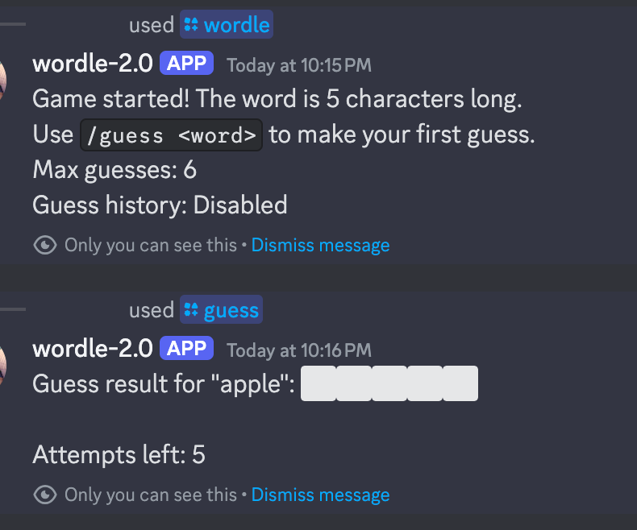
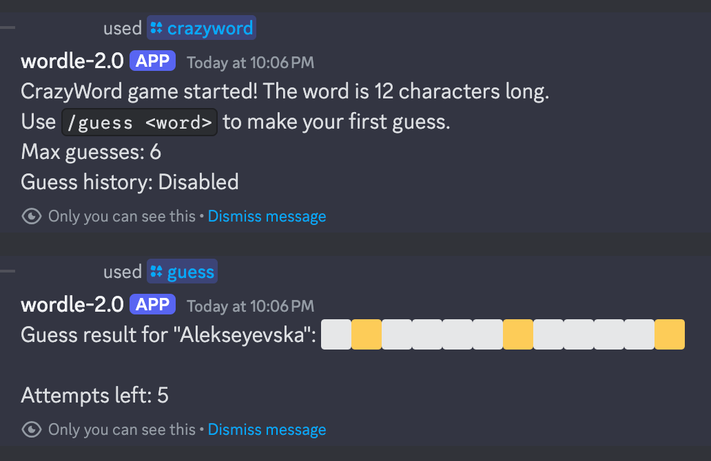
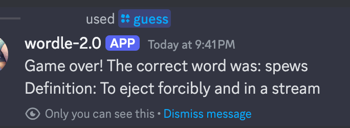

# Discord Bot: Wordle + Wordle 2.0
## Mimi Pieper

Welcome to  my project born out of nostalgia, love for Wordle, and way WAY too much time on Discord. This was created in just a couple of hours over a weekend, so if there are mistakes, please fix them! (or ignore them)

This bot is perfect for anyone who loves Wordle and spends way too much time on Discord. For now, you’ll need to manually host it to run, but I might set it up for public use soon!

### Backstory (feel free to ignore)
I first created a Wordle bot in C++ when I was just starting out as a developer. I looked back on it before starting this and frankly I'm shocked it ran. Now, I’ve recreated it in JavaScript with modern best practices, new features, and scalability in mind. I think it's really fun to look back how far I've come as a programmer. That project was daunting to me when I first started coding and took way too long. This, I banged out in just a few hours. I struggle at times to see how I improved and this was really cool to see.

---

## Current Modes
- **Classic Wordle:** Play the beloved 5-letter guessing game with your friends.
- **CrazyWord Mode:** Take on words of any length. The bot tells you how long the word is and lets you guess.
- **Custom Options:**
  - Set the number of allowed guesses with `/wordle maxguesses:10`.
  - Enable or disable guess history with `/wordle showhistory:true`.
- **Helpful Feedback:** Every guess is evaluated with emoji indicators (`🟩`, `🟨`, `⬜`).
- **Definitions:** Win or lose, the bot fetches a definition of the word to expand your vocabulary.

---

## Screenshots




---

## Run Your Own Bot
### Prerequisites
1. A Discord server where you have admin access.
2. Set up a bot on the [Discord Developer Portal](https://discordjs.guide/#before-you-begin).

### Quick Start
1. Clone this repository.
2. Set up your bot using this guide: [Discord.js](https://discordjs.guide/#before-you-begin).
3. Use this pre-configured OAuth link to add the bot to your server:  
   `https://discord.com/api/oauth2/authorize?client_id=YOUR_CLIENT_ID&permissions=53687430144&scope=bot%20applications.commands`  
   Replace `YOUR_CLIENT_ID` with your bot’s client ID.
   - You will need to run it again every time if you change any `slash` commands
4. Install dependencies: `npm install`.
5. Create a `config.json` file in the root and add in your secrets from Discord Developer:
```javascript
{
  "token": "",
  "clientId": ""
}

```
6. Create a `.env` file as well and add in your Discord token:
```javascript
DISCORD_TOKEN=""

```
5. Start the bot: `node index.js`.

---
## Code Overview

### GameState
Managing multiple users playing Wordle simultaneously requires multiple management of data. Instead of storing this data directly in individual command handlers, I created a shared GameState. This centralized state ensures consistency and lets all game variations (Wordle, CrazyWord, and more) operate smoothly. Furthermore, it is fast, which is a requirement for using Discord's API.

### WordleGame Class
I noticed a lot of overlapping logic between Wordle and CrazyWord—things like evaluating guesses, fetching definitions, and handling game flow. So, I refactored that logic into a reusable WordleGame class. Now, any new game variations can inherit this functionality, reducing redundancy and keeping the code DRY. This makes the bot highly scalable for future updates. I plan on adding a lot more to the code :)

### Word Definition
I do use the API from Free Dicitonary API for word defintions [link here](https://dictionaryapi.dev/). This isn't perfect, I notice a lot of missing definitions happen, but it is pretty good.

---

## Word Sources
The words come from the [english-words](https://github.com/dwyl/english-words) repository. I parsed the master text file locally to create different word lists. Thank you, DWYL!

### Word Lists
There are about 460k words in the English language, they are pretty much all included here. 

However, since Discord has a 3 second API time out, I wanted to ensure that the lists of words were not overly large. Here are the counts of the included lists.

Feel free to run the count function in `word_parser.py` for the numbers yourself.

For CrazyWord mode, the bot uses the full list. In Classic Wordle, it’s restricted to 5-letter words.

---

## Planned Features
1. **Odd Word Mode:** Play Wordle with words containing non-alphabetic characters (e.g., `o'clock` or `co-op`).
2. **Custom Word Lengths:** Choose how many letters your Wordle word will have.
3. **Urban Dictionary Wordle:** Guess words from Urban Dictionary definitions for an extra challenge.

---

## Why Grumpy Cat?

Because the Discord documentation made me pull my hair out.


If you’re reading this, I hope you enjoy the bot as much as I enjoyed creating it. Feel free to fork, clone, or contribute to the project.
